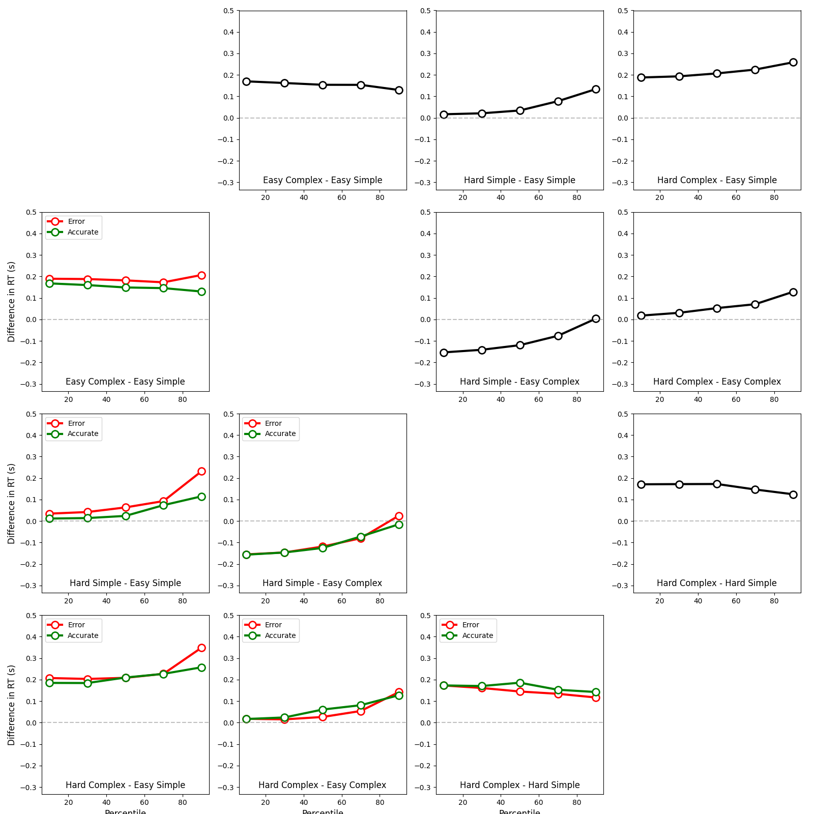
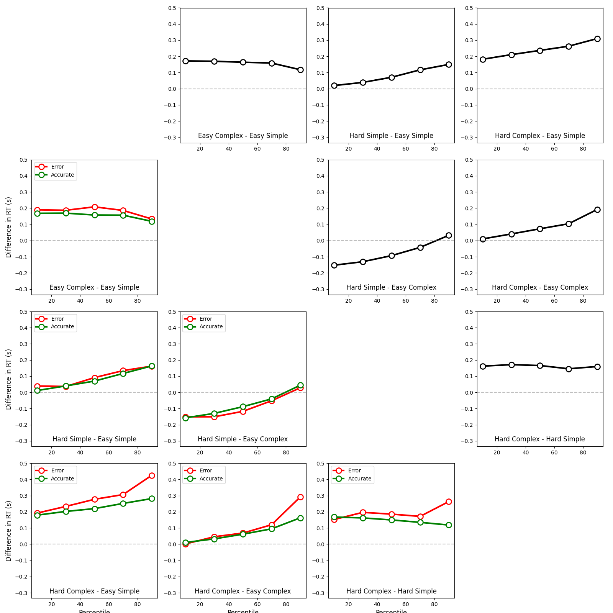
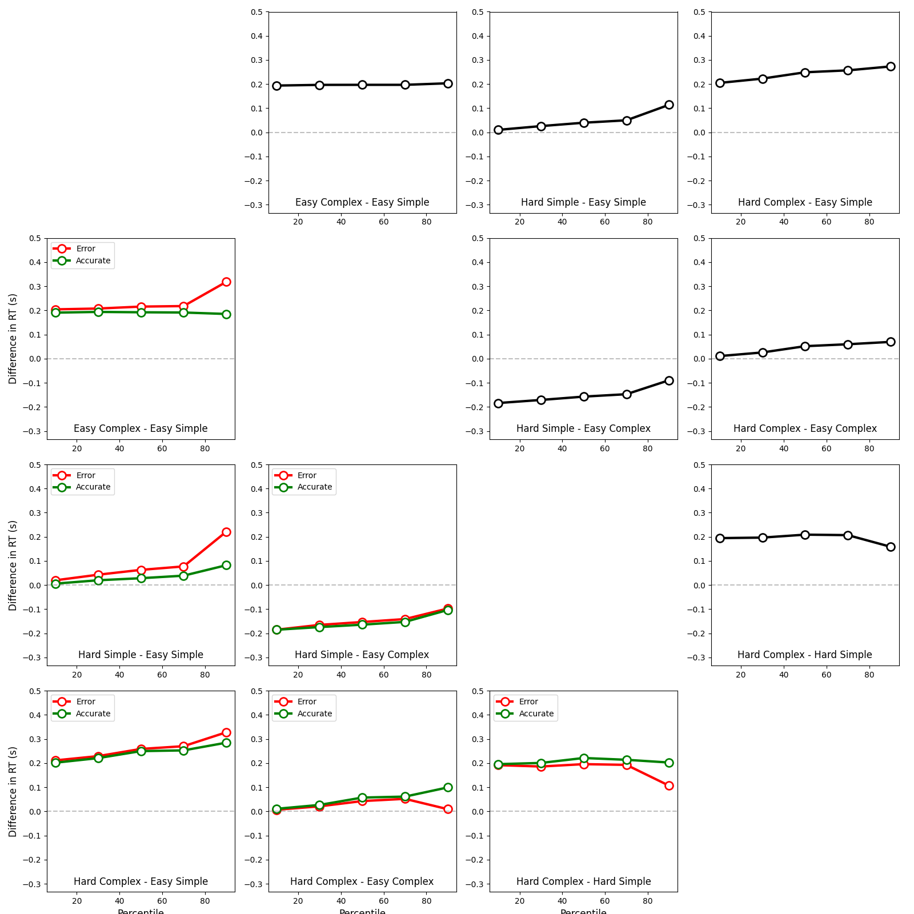

# SDT & Diffusion Analysis Report

## 1. Objective

This report analyzes simulated response time and accuracy data using:

- **Signal Detection Theory (SDT)** to estimate participants’ sensitivity ($d'$) and decision criterion ($c$)
- **Delta plots** to visualize response time distributions, supporting interpretation from a diffusion modeling perspective

The data follows a $2 \times 2$ factorial design:
- **Trial Difficulty**: Easy vs Hard  
- **Stimulus Type**: Simple vs Complex

The goal is to assess how both factors influence performance.

---

## 2. SDT Model

We used a hierarchical Bayesian SDT model. In this version:

- $d'$ and $c$ are modeled at the **participant × condition** level
- Their **group-level means** are functions of:
  - Stimulus ($\text{stim}$)
  - Difficulty ($\text{diff}$)
  - Stimulus × Difficulty interaction

Group-level structure for $d'$:

$$
\mu_{d'} = \alpha_{d'} + \beta_{\text{stim}} \cdot \text{stim} + \beta_{\text{diff}} \cdot \text{diff} + \beta_{\text{int}} \cdot (\text{stim} \times \text{diff})
$$

Group-level structure for $c$:

$$
\mu_c = \alpha_c + \gamma_{\text{stim}} \cdot \text{stim} + \gamma_{\text{diff}} \cdot \text{diff} + \gamma_{\text{int}} \cdot (\text{stim} \times \text{diff})
$$

---

## 3. Convergence Diagnostics

All model chains converged well:

- $\hat{R}$ for all parameters = **1.00**
- Effective sample sizes are high ($>6000$)
- No sampling pathologies observed

---

## 4. Posterior Distributions

The posterior distributions below confirm the effect strength and uncertainty.

---

## 5. Effect Size Comparison

Posterior summaries:

| Parameter             | Mean ± SD      |
|----------------------|----------------|
| $d'$ Stimulus Effect ($\beta_{\text{stim}}$) | $0.565 \pm 0.416$ |
| $d'$ Difficulty Effect ($\beta_{\text{diff}}$) | $-2.502 \pm 0.447$ |
| $c$ Stimulus Effect ($\gamma_{\text{stim}}$) | $0.147 \pm 0.238$ |
| $c$ Difficulty Effect ($\gamma_{\text{diff}}$) | $-1.567 \pm 0.237$ |

Posterior probability comparison:

- $P(|\beta_{\text{stim}}| > |\beta_{\text{diff}}|) = 0.005$
- $P(|\gamma_{\text{stim}}| > |\gamma_{\text{diff}}|) = 0.001$

Conclusion: Trial difficulty has a substantially larger effect on both sensitivity ($d'$) and decision criterion ($c$) compared to stimulus type.

---

## 6. Delta Plots

Delta plots were generated per participant to visualize:

- **Overall RT shifts** (upper triangle)
- **Accurate vs Error response time differences** (lower triangle)

This complements the SDT analysis with diffusion-informed insights.

Examples (1 participant per row):

| Participant | Delta Plot |
|-------------|------------|
| P1 |  |
| P2 |  |
| P3 |  |
| P4 |  |
| P5 |  |

Interpretation:

- Easy trials (especially Simple stimuli) yield faster and more consistent RTs
- Error responses generally have different delta shapes than accurate ones
- Delta plots support the SDT conclusion: **difficulty impacts RT distributions more than stimulus complexity**

---

## 7. Summary

- SDT model converged cleanly with interpretable parameters
- Trial difficulty showed strong negative effect on both $d'$ and $c$
- Stimulus effects were small and uncertain
- Delta plots aligned with SDT results

This dual approach confirms that **trial difficulty is the dominant driver of both perceptual and decisional components** in this task.
