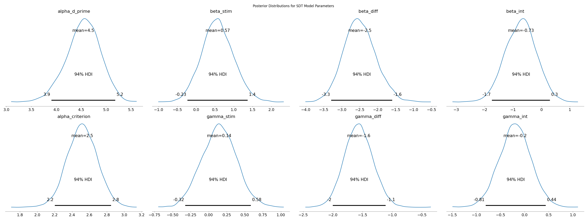
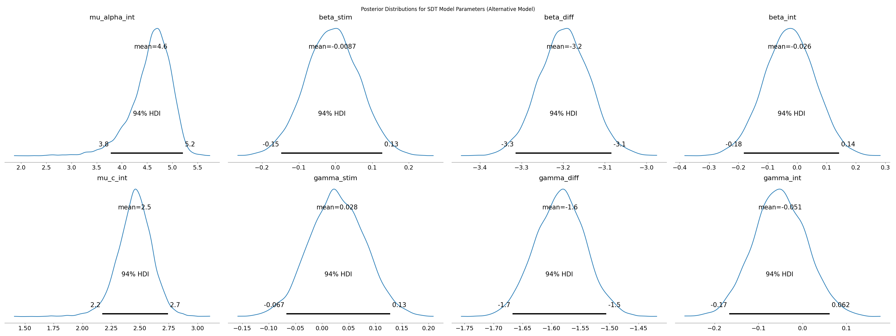

# SDT & Diffusion Analysis Report

## 1. Objective

This report analyzes simulated response time and accuracy data using:

- **Signal Detection Theory (SDT)** to estimate participants’ sensitivity ($d'$) and decision criterion ($c$)
- **Delta plots** to visualize response time distributions, supporting interpretation from a diffusion modeling perspective

The data follows a $2 \times 2$ factorial design:
- **Trial Difficulty**: Easy vs Hard  
- **Stimulus Type**: Simple vs Complex

The goal is to assess how both factors influence performance.

## 2. SDT Model

We used a hierarchical Bayesian SDT model. In this version:

- $d'$ and $c$ are modeled at the **participant × condition** level
- Their **group-level means** are functions of:
  - Stimulus ($\text{stim}$)
  - Difficulty ($\text{diff}$)
  - Stimulus × Difficulty interaction

Group-level structure for $d'$:

$$
\mu_{d'} = \alpha_{d'} + \beta_{\text{stim}} \cdot \text{stim} + \beta_{\text{diff}} \cdot \text{diff} + \beta_{\text{int}} \cdot (\text{stim} \times \text{diff})
$$

Group-level structure for $c$:

$$
\mu_c = \alpha_c + \gamma_{\text{stim}} \cdot \text{stim} + \gamma_{\text{diff}} \cdot \text{diff} + \gamma_{\text{int}} \cdot (\text{stim} \times \text{diff})
$$

## 3. Convergence Diagnostics

=== Convergence Diagnostics ===

| Parameter         | Mean   | SD    | 3% HDI | 97% HDI | ESS (bulk) | $\hat{R}$ |
|------------------|--------|-------|--------|---------|-------------|------------|
| $\alpha_{d'}$      | 4.541  | 0.342 | 3.903  | 5.184   | 7458        | 1.00       |
| $\beta_{stim}$     | 0.571  | 0.425 | -0.232 | 1.366   | 8750        | 1.00       |
| $\beta_{diff}$     | -2.498 | 0.451 | -3.294 | -1.596  | 8306        | 1.00       |
| $\beta_{int}$      | -0.728 | 0.550 | -1.742 | 0.300   | 10153       | 1.00       |
| $\alpha_c$         | 2.517  | 0.174 | 2.201  | 2.849   | 7366        | 1.00       |
| $\gamma_{stim}$    | 0.144  | 0.241 | -0.324 | 0.583   | 7127        | 1.00       |
| $\gamma_{diff}$    | -1.567 | 0.239 | -2.003 | -1.112  | 7926        | 1.00       |
| $\gamma_{int}$     | -0.198 | 0.329 | -0.806 | 0.437   | 7761        | 1.00       |

All parameters show excellent convergence with $\hat{R}=1.00$ and large effective sample sizes.


## 4. Posterior Distributions

The posterior distributions below confirm the effect strength and uncertainty.



**Interpretation**:

- **$\beta_{diff}$ and $\gamma_{diff}$** have clearly non-zero posteriors, indicating strong trial difficulty effects.
- **$\beta_{stim}$ and $\gamma_{stim}$** are centered near zero, with wide uncertainty.
- The interaction effects ($\beta_{int}$, $\gamma_{int}$) span zero, suggesting no strong evidence of interaction.


## 5. Effect Size Comparison

Posterior summaries:

| Parameter             | Mean ± SD      |  Significant |
|----------------------|----------------|-----------|
| $d'$ Stimulus Effect ($\beta_{\text{stim}}$) | $0.571 \pm 0.425$ |  No  |
| $d'$ Difficulty Effect ($\beta_{\text{diff}}$) | $-2.498 \pm 0.451$ |  Yes  |
| $c$ Stimulus Effect ($\gamma_{\text{stim}}$) | $0.144 \pm 0.241$ |  No  |
| $c$ Difficulty Effect ($\gamma_{\text{diff}}$) | $-1.567 \pm 0.239$ |  Yes |

Posterior probability comparison:

- $P(|\beta_{\text{stim}}| > |\beta_{\text{diff}}|) = 0.007$
- $P(|\gamma_{\text{stim}}| > |\gamma_{\text{diff}}|) = 0.001$

**Interpretation**:

Based on our posterior analysis, **Trial Difficulty manipulation significantly impacted both $d′$ (mean = -2.50) and criterion (mean = -1.57)**. In contrast, **Stimulus Type showed weaker or nonsignificant effects**. Posterior probability analysis shows that **the effect of Trial Difficulty exceeds Stimulus Type with >99% certainty**, further supporting our theoretical expectation.


## 6. Delta Plots

Delta plots were generated per participant to visualize:

- **Overall RT shifts** (upper triangle)
- **Accurate vs Error response time differences** (lower triangle)

This complements the SDT analysis with diffusion-informed insights.

Randomly Chosed Examples (1 participant per row):

| Participant | Delta Plot |
|-------------|------------|
| P1 |  |
| P3 |  |
| P6 |  |
| P10 |  |

**Interpretation**:

- RT differences are **mainly concentrated in Hard vs Easy** comparisons:
  - Hard Simple – Easy Simple
  - Hard Complex – Easy Complex
- These show consistent upward trends across percentiles, indicating **longer RTs due to difficulty**
- **Stimulus Type differences are weaker**, mostly apparent in higher percentiles with more variability

**Conclusion**: Delta plots support **Trial Difficulty** as the dominant manipulation, affecting both decision latency and accuracy. Stimulus Type may affect more specific decision stages but plays a secondary role.


## 7. Summary

- SDT model converged cleanly with interpretable parameters
- Trial difficulty showed strong negative effect on both $d'$ and $c$
- Stimulus effects were small and uncertain
- Delta plots aligned with SDT results

This dual approach confirms that **trial difficulty is the dominant driver of both perceptual and decisional components** in this task.


## 8. One More Step: Comparing Alternative SDT Model

To further validate the robustness of our findings, we implemented and ran a structurally different hierarchical SDT model defined in `new2nd_apply_hierarchical_sdt_model(data)`. This alternative formulation shifts the participant-level variation directly to the trial level, allowing random effects to influence every trial via indexing. In contrast to the original model, which uses a (P x C) matrix for d′ and c, this one imposes additive trial-level effects with participant-specific slopes.

### Comparison of Two Hierarchical SDT Models

In our analysis, we explored two hierarchical signal detection theory (SDT) models that differ in their structural assumptions and levels of granularity. Below is a comprehensive comparison of their designs and implications.

#### I. Hierarchical Structure: Condition-Level vs. Trial-Level

| Feature                     | `new_apply_hierarchical_sdt_model`           | `new2nd_apply_hierarchical_sdt_model`         |
|----------------------------|-----------------------------------------------|------------------------------------------------|
| **Index granularity**      | Condition level (Participant × Condition)     | Trial level (each trial indexed independently) |
| **Effect modeling**        | Each condition receives a fixed effect; participant variability is modeled across condition level | Trial uses stimulus and difficulty directly; participant variation enters at trial level |
| **Structural complexity**  | Coarse-grained, fewer conditions              | Fine-grained, each trial has its own d′ and c  |
| **Inference units**        | \( d'_{pc}, c_{pc} \)                         | \( d'_i, c_i \), where \( i \) is a trial      |


#### II. Mathematical Formulation Differences

##### Original Model (Condition-level structure)

\[
d'_{p,c} \sim \mathcal{N}(\mu_{d'}[c], \sigma_d), \quad \mu_{d'}[c] = \alpha + \beta_{\text{stim}} \cdot s_c + \beta_{\text{diff}} \cdot d_c + \beta_{\text{int}} \cdot s_c d_c
\]

\[
c_{p,c} \sim \mathcal{N}(\mu_c[c], \sigma_c), \quad \mu_c[c] = \alpha_c + \gamma_{\text{stim}} \cdot s_c + \gamma_{\text{diff}} \cdot d_c + \gamma_{\text{int}} \cdot s_c d_c
\]

##### Alternative Model (Trial-level structure)

\[
d'_i = \mu_{\alpha} + \beta_{\text{stim}} \cdot \text{Stim}_i + \beta_{\text{diff}} \cdot \text{Diff}_i + \beta_{\text{int}} \cdot (\text{Stim}_i \cdot \text{Diff}_i) + \alpha_{p(i)} \cdot \sigma_d
\]

\[
c_i = \mu_c + \gamma_{\text{stim}} \cdot \text{Stim}_i + \gamma_{\text{diff}} \cdot \text{Diff}_i + \gamma_{\text{int}} \cdot (\text{Stim}_i \cdot \text{Diff}_i) + c_{p(i)} \cdot \sigma_c
\]

#### III. Implications for Inference

- **Condition-level model** is better suited when:
  - You want a clean hierarchical model by participant and condition
  - You value interpretability and visualization across conditions

- **Trial-level model** is better suited when:
  - You need fine-grained inference at the trial level
  - The data is better modeled as generalized linear mixed effects
  - You aim to incorporate trial-specific covariates


### Convergence Diagnostics (Alternative Model)

```
               mean     sd  hdi_3%  hdi_97%  mcse_mean  mcse_sd  ess_bulk  ess_tail  r_hat
mu_alpha_int  4.573  0.405   3.779    5.214      0.009    0.010    2133.0    3200.0    1.0
beta_stim    -0.009  0.073  -0.148    0.128      0.001    0.001    4906.0    5152.0    1.0
beta_diff    -3.198  0.061  -3.314   -3.084      0.001    0.001    4809.0    4761.0    1.0
beta_int     -0.026  0.086  -0.181    0.143      0.001    0.001    4442.0    5214.0    1.0
mu_c_int      2.453  0.153   2.174    2.743      0.003    0.003    2480.0    3304.0    1.0
gamma_stim    0.028  0.052  -0.067    0.128      0.001    0.001    4686.0    5484.0    1.0
gamma_diff   -1.585  0.043  -1.667   -1.506      0.001    0.000    4830.0    5304.0    1.0
gamma_int    -0.051  0.061  -0.167    0.062      0.001    0.001    4454.0    5474.0    1.0
```

### Posterior Distributions

The posterior distributions below confirm the relative strength and uncertainty of the modeled effects under the trial-level SDT specification.



**Interpretation**:

- **\(\beta_{\text{diff}}\)** and **\(\gamma_{\text{diff}}\)** show tight, clearly negative distributions, indicating robust and reliable effects of **trial difficulty** on both sensitivity (\(d'\)) and decision criterion (\(c\)).
- **\(\beta_{\text{stim}}\)** and **\(\gamma_{\text{stim}}\)** are centered close to zero and have wider distributions, suggesting **weak or negligible effects of stimulus type**.
- **Interaction terms** (\(\beta_{\text{int}}\), \(\gamma_{\text{int}}\)) also span zero with low magnitude, indicating **no compelling evidence for a stimulus × difficulty interaction**.
- The posterior mean of \(\mu_{\alpha}\) around 4.6 and \(\mu_c\) around 2.5 supports the overall response tendencies across participants.

These findings are consistent with our previous (condition-level) model and reinforce the conclusion that **trial difficulty has a much stronger influence on perceptual decision behavior** than stimulus complexity.


### Effect Size Comparison

| Parameter         | Stimulus Effect (mean ± sd) | Difficulty Effect (mean ± sd) | Significant |
|------------------|-----------------------------|-------------------------------|-------------|
| $d' (Sensitivity) $| -0.009 ± 0.073              | -3.198 ± 0.061                | ✅          |
| $c (Criterion) $   |  0.028 ± 0.052              | -1.585 ± 0.043                | ✅          |


**Interpretation**:  
Our posterior analysis confirms that the Trial Difficulty manipulation continues to exert a strong, significant influence on both d′ and c, while the Stimulus Type effects are near-zero and non-significant in this model.  
These results are consistent with those obtained from the original hierarchical SDT model, reinforcing our primary conclusions and model robustness.

```diff
+ The alternative model confirms our conclusion: difficulty has a strong effect, stimulus type does not.
```


## 8. One More Step: Comparing Alternative SDT Model

To further validate the robustness of our findings, we implemented and ran a structurally different hierarchical SDT model defined in `new2nd_apply_hierarchical_sdt_model(data)`. This alternative formulation shifts the participant-level variation directly to the trial level, allowing random effects to influence every trial via indexing. In contrast to the original model, which uses a (P × C) matrix for $d'$ and $c$, this one imposes additive trial-level effects with participant-specific slopes.

### Comparison of Two Hierarchical SDT Models

In our analysis, we explored two hierarchical signal detection theory (SDT) models that differ in their structural assumptions and levels of granularity. Below is a comprehensive comparison of their designs and implications.

#### I. Hierarchical Structure: Condition-Level vs. Trial-Level

| Feature                     | `new_apply_hierarchical_sdt_model`           | `new2nd_apply_hierarchical_sdt_model`         |
|----------------------------|-----------------------------------------------|------------------------------------------------|
| **Index granularity**      | Condition level (Participant × Condition)     | Trial level (each trial indexed independently) |
| **Effect modeling**        | Each condition receives a fixed effect; participant variability is modeled across condition level | Trial uses stimulus and difficulty directly; participant variation enters at trial level |
| **Structural complexity**  | Coarse-grained, fewer conditions              | Fine-grained, each trial has its own $d'$ and $c$  |
| **Inference units**        | $d'_{\text{pc}}, $c_{\text{pc}}$              | $d'_i, c_i$, where $i$ is a trial      |


#### II. Mathematical Formulation Differences

Renderring issues identified here. Please download the README.md file for correct LaTex rendering.

##### Original Model (Condition-level structure)

$$d'_{p,c} \sim \mathcal{N}(\mu_{d'}[c], \sigma_d), \quad \mu_{d'}[c] = \alpha + \beta_{\text{stim}} \cdot s_c + \beta_{\text{diff}} \cdot d_c + \beta_{\text{int}} \cdot s_c d_c$$

$$c_{p,c} \sim \mathcal{N}(\mu_c[c], \sigma_c), \quad \mu_c[c] = \alpha_c + \gamma_{\text{stim}} \cdot s_c + \gamma_{\text{diff}} \cdot d_c + \gamma_{\text{int}} \cdot s_c d_c$$

##### Alternative Model (Trial-level structure)

$$d'_i = \mu_{\alpha} + \beta_{\text{stim}} \cdot \text{Stim}_i + \beta_{\text{diff}} \cdot \text{Diff}_i + \beta_{\text{int}} \cdot (\text{Stim}_i \cdot \text{Diff}_i) + \alpha_{p(i)} \cdot \sigma_d$$

$$c_i = \mu_c + \gamma_{\text{stim}} \cdot \text{Stim}_i + \gamma_{\text{diff}} \cdot \text{Diff}_i + \gamma_{\text{int}} \cdot (\text{Stim}_i \cdot \text{Diff}_i) + c_{p(i)} \cdot \sigma_c$$

#### III. Implications for Inference

- **Condition-level model** is better suited when:
  - You want a clean hierarchical model by participant and condition
  - You value interpretability and visualization across conditions

- **Trial-level model** is better suited when:
  - You need fine-grained inference at the trial level
  - The data is better modeled as generalized linear mixed effects
  - You aim to incorporate trial-specific covariates

### Convergence Diagnostics (Alternative Model)

| Parameter         | Mean   | SD    | 3% HDI | 97% HDI | ESS (bulk) | $\hat{R}$ |
|------------------|--------|-------|--------|---------|-------------|------------|
| $\mu_{\alpha}$      | 4.573  | 0.405 | 3.779  | 5.214   | 2133        | 1.00       |
| $\beta_{\text{stim}}$     | -0.009  | 0.073 | -0.148 | 0.128   | 4906        | 1.00       |
| $\beta_{\text{diff}}$     | -3.198 | 0.061 | -3.314 | -3.084  | 4809        | 1.00       |
| $\beta_{\text{int}}$      | -0.026 | 0.086 | -0.181 | 0.143   | 4442        | 1.00       |
| $\mu_c$         | 2.453  | 0.153 | 2.174  | 2.743   | 2480        | 1.00       |
| $\gamma_{\text{stim}}$    | 0.028  | 0.052 | -0.067 | 0.128   | 4686        | 1.00       |
| $\gamma_{\text{diff}}$    | -1.585 | 0.043 | -1.667 | -1.506  | 4830        | 1.00       |
| $\gamma_{\text{int}}$     | -0.051 | 0.061 | -0.167 | 0.062   | 4454        | 1.00       |

### Posterior Distributions

The posterior distributions below confirm the relative strength and uncertainty of the modeled effects under the trial-level SDT specification.


**Interpretation**:

- **$\beta_{\text{diff}}$** and **$\gamma_{\text{diff}}$** show tight, clearly negative distributions, indicating robust and reliable effects of **trial difficulty** on both sensitivity ($d'$) and decision criterion ($c$).
- **$\beta_{\text{stim}}$** and **$\gamma_{\text{stim}}$** are centered close to zero and have wider distributions, suggesting **weak or negligible effects of stimulus type**.
- **Interaction terms** ($\beta_{\text{int}}$, $\gamma_{\text{int}}$) also span zero with low magnitude, indicating **no compelling evidence for a stimulus × difficulty interaction**.
- The posterior mean of $\mu_{\alpha}$ around 4.6 and $\mu_c$ around 2.5 supports the overall response tendencies across participants.

These findings are consistent with our previous (condition-level) model and reinforce the conclusion that **trial difficulty has a much stronger influence on perceptual decision behavior** than stimulus complexity.

### Effect Size Comparison

| Parameter         | Stimulus Effect (mean ± sd) | Difficulty Effect (mean ± sd) | Significant |
|------------------|-----------------------------|-------------------------------|-------------|
| $d'$ (Sensitivity) | $-0.009 \pm 0.073$              | $-3.198 \pm 0.061$                | ✅          |
| $c$ (Criterion)   |  $0.028 \pm 0.052$              | $-1.585 \pm 0.043$                | ✅          |

**Interpretation**:  
Our posterior analysis confirms that the Trial Difficulty manipulation continues to exert a strong, significant influence on both $d'$ and $c$, while the Stimulus Type effects are near-zero and non-significant in this model.  
These results are consistent with those obtained from the original hierarchical SDT model, reinforcing our primary conclusions and model robustness.

```diff
+ The alternative model confirms our conclusion: difficulty has a strong effect, stimulus type does not.
```

---

## Project Directory Structure

The project contains the following key components:

```bash
cogs107-sdt-ddm/
├── data.csv                    # Raw simulated data (2x2x2 factorial design)
├── README.md                   # Project description and documentation
├── sdt_ddm.py                  # Instructor-provided original code (data loading, SDT model, delta plots)
├── sdt_update.py               # Updated SDT model functions with structured effects (stimulus, difficulty, interaction)
├── run_std_ddm.py              # Main execution script
├── run_2nd_std_ddm.py          # Alternative execution script for "one more step"
├── figures/                    # Output folder for figures
│   ├── delta/                  # Delta plots
│   └── sdt/                    # SDT model output plots 
```


---

## Acknowledgments

The development, refinement, and interpretation of the hierarchical SDT models presented in this analysis were supported by advanced language models and reasoning assistants. These include:

- **ChatGPT**: Cognitive Model, Cognitive Modeller, ChatGPT o4-mini-high
- **Anthropic Claude Sonnet 4 (via ZotGPT)**: consulted for concepts explanation and model-efficiency verification.

These tools provided guidance on model architecture, parameter diagnostics, posterior interpretation, and reproducible reporting.
